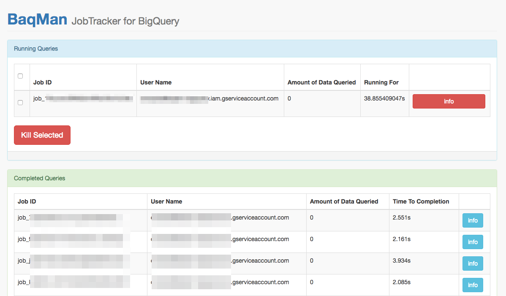

# BaqMan [](https://travis-ci.org/sojern/baqman)

## Synopsis

Tool for tracking/killing BigQuery jobs, i.e. JobTracker for BigQuery, runs on AppEngine.





## Run Locally,

Run,

```
go run *.go
```

and open `http://localhost:8080`

## Deploy

Deploy on AppEngine on the same project where you use BigQuery, and **secure it with IAP (Identity Aware Proxy)**

```
$ gcloud app deploy --version flip --project <PROJECT>
```

## Development and Testing

### Install the Go dependencies:

```
$ go get github.com/sojern/baqman
$ cd $GOPATH/src/github.com/sojern/baqman
$ go get -u github.com/golang/dep/cmd/dep
$ dep ensure
```

### Run the Tests

```
$ go test ./...
ok    github.com/sojern/baqman   0.012s
...
